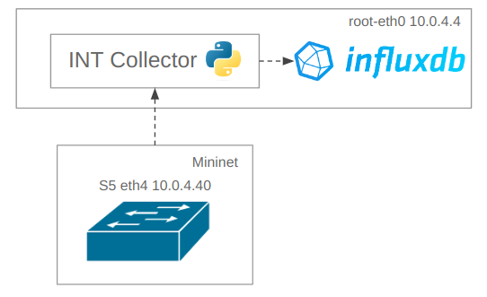

# Inband-Network Telemetry Monitoring System


## Introduction

The Inband-Network Telemetry Monitoring System is responsible for parsing the INT Reports and sending the INT data to a Database for further visualization and analysis.

The system architecture is here presented:

<p align="center"></p>

The connectivity between Mininet and the Collector was achieved by adding static routes between the local machine and the Mininet emulated network.

### INT Collector
The `INTCollector.py` is a Python program that parses an INT Report according to the defined headers. Using the `scappy` library, the program sniffs the incoming UDP traffic that reaches interface `root-eth0`, with source IP `10.0.4.40`.
 After being parsed, the INT data is stored in the InfluxDB database using the `InfluxDB Python client library`. 

  An InfluxDB Client is started using the previously generated Token for authentication, then it is possible to read and write from the database.


1. Client Connection Example

```bash
token = "token"
org = "org"
url = "http://localhost:8086"

write_client = influxdb_client.InfluxDBClient(url=url, token=token, org=org)
```

2. Write Operation Example

```bash
bucket="bucket"

write_api = client.write_api(write_options=SYNCHRONOUS)
   
for value in range(5):
  point = (
    Point("measurement1")
    .tag("tagname1", "tagvalue1")
    .field("field1", value)
  )
  write_api.write(bucket=bucket, org="org", record=point)
  time.sleep(1) # separate points by 1 second
```

3. Read Operation Example

```bash
query_api = client.query_api()

query = """from(bucket: "bucket")
 |> range(start: -10m)
 |> filter(fn: (r) => r._measurement == "measurement1")"""
tables = query_api.query(query, org="org")

for table in tables:
  for record in table.records:
    print(record)
```


### InfluxDB v2
 InfluxDBv2 is a high-performance time series database, i.e. a database in which the data is queried and indexed based on timestamps. InfluxDB provides a Graphical User Interface (GUI) that is important to ease the analysis of the received data as well as to display the INT information using the built-in graphs and dashboards.

 The data can also be queried in the GUI done using InfluxQL, a SQL-like query language specifically designed to interact with InfluxDB. 
 
 As the InfluxDB instance will be launched on the local computer, the GUI can be found on: http://localhost:8086/


<p align="center"></p>


### Installation Instructions

Run these commands to install the necessary Python 3 modules and InfluxDB v2 Service (Linux):

1. Python Modules

```sh
pip install influxdb-client
pip install scapy
pip install python-dotenv
pip install bitarray
```
2. InfluxDB Package

```sh
sudo apt-get install influxdb2
```

Open in your web browser the following link to get an Access Token for InfluxDb Client:
```sh
http://localhost:8086/orgs/fbf55d118a118af9/new-user-setup/python

A .env file should be created to store the Acess Token, org and bucket Name (all defined on the GUI)

TOKEN = 'Generated Token'
ORG = 'org name'
BUCKET = 'bucket name'
```

To have connectivity between the Mininet Network and the INT Collector, apply the following command:
```sh
sudo route add -net 10.0.4.0/24 gw 10.0.4.40
```


### Running Instructions

1. To run INT Collector:

```bash
python INTCollector.py
```

2. To launch InfluxDB:
```sh
sudo service influxdb start
```

## Relevant Documentation

The INT Collector was adapted from two source codes available on GitHub:

1. Cisco Internship Inband-Network Telemetry Collector: https://github.com/ishaansathaye/int-collector-cisco/blob/master/INTCollector.py

2. Exercise from P4 Tutorial: https://github.com/p4lang/tutorials/blob/master/exercises/mri/receive.py


The InfluxDB v2 Documentation can be found here: https://docs.influxdata.com/influxdb/v2/

The Report Specification can be found here: https://p4.org/p4-spec/docs/telemetry_report_v2_0.pdf