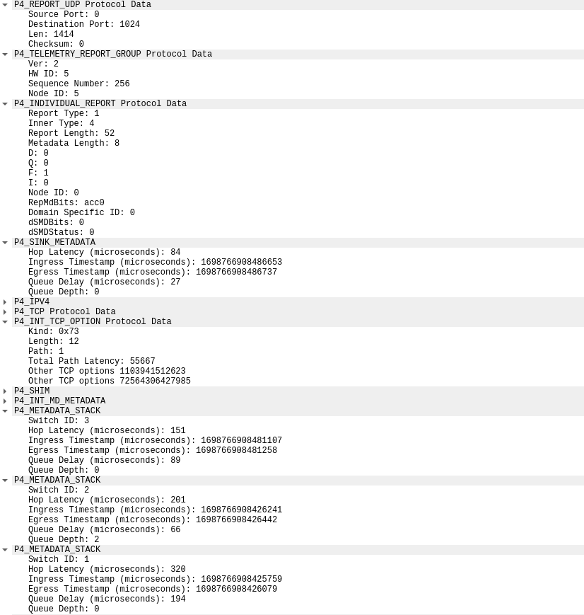

# INT Wireshark Dissector


## Introduction

The INT Wireshark Dissector helps in parsing all the custom INT/P4 header formats used in this INT implementation.  This tool provides much more visibility of the values assigned to each header, since we no longer need to search the raw packet bytes for debugging and analysis.

It is provided a file for each header and the main file `init.lua` calls each one of them. 

This Dissector was designed to meet specific INT Headers, it needs code adaptation to be suitable for distinct INT deployments.

Here is an example of how an INT Report is displayed in Wireshark, using this dissector:

<p align="center"></p>


### Running Instructions

In your shell, run:

```bash
sudo wireshark -X lua_script:init.lua 
```

## Relevant Documentation

The starting point for this INT Dissector was the source code available on GitHub: https://github.com/NUS-SNL/p4-traffictool

Due to some particularities (for instance repeated metadata headers) in the provided P4 file, the output of this P4 Dissector Generator was not enough to dissect most of the defined INT headers, so it was only utilized as an example of how a Wireshark Dissector can be coded and structured using Lua Programming Language.
